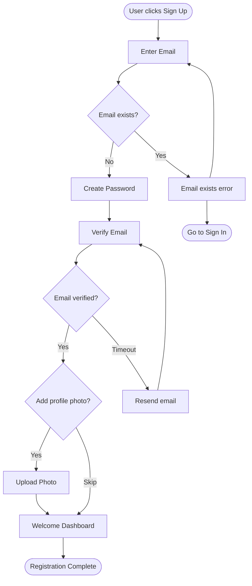

# User Flow Skill

**RMS Skill v2.0** | Map user journeys, task flows, and interaction sequences using requirements context and existing documentation from the MLDA knowledge graph

## When to Use

- Mapping user journeys for new features
- Documenting existing user flows
- Identifying pain points and optimization opportunities
- Communicating flow logic to developers and stakeholders
- Validating requirements coverage

## Prerequisites

- User stories or requirements with DOC-ID references
- Understanding of user goals and personas
- Existing system documentation (recommended)
- MLDA initialized if using Neocortex integration

---

## Workflow Overview

```
+-----------------------------------------------------------------------+
|                    USER FLOW WORKFLOW                                  |
+-----------------------------------------------------------------------+
|                                                                        |
|  Phase 1: Context Gathering (Neocortex)                               |
|    +-- Load user stories/requirements (DOC-REQ-xxx)                   |
|    +-- Load persona documentation (DOC-PERSONA-xxx)                   |
|    +-- Load existing flows (DOC-UF-xxx)                               |
|    +-- Load system constraints (DOC-ARCH-xxx, DOC-API-xxx)            |
|                                                                        |
|  Phase 2: Flow Scope Definition                                        |
|    +-- Identify user goal(s)                                          |
|    +-- Define flow boundaries (start/end)                             |
|    +-- Identify actors involved                                        |
|    +-- Classify flow type                                              |
|                                                                        |
|  Phase 3: Entry Point Mapping                                          |
|    +-- List all possible entry points                                 |
|    +-- Document preconditions                                          |
|    +-- Identify user context at entry                                  |
|                                                                        |
|  Phase 4: Step-by-Step Flow Definition                                 |
|    +-- Map happy path first                                           |
|    +-- Document decision points                                        |
|    +-- Identify system interactions                                    |
|    +-- Note data requirements                                          |
|                                                                        |
|  Phase 5: Alternative Paths & Edge Cases                               |
|    +-- Map error scenarios                                             |
|    +-- Document recovery flows                                         |
|    +-- Identify edge cases                                             |
|    +-- Define timeout/abandon handling                                 |
|                                                                        |
|  Phase 6: Exit Point Documentation                                     |
|    +-- List all exit points                                           |
|    +-- Document success criteria                                       |
|    +-- Define post-flow states                                         |
|                                                                        |
|  Phase 7: Output Generation                                            |
|    +-- Generate flow diagram (text/mermaid)                           |
|    +-- Create flow specification document                              |
|    +-- Link to requirements traceability                               |
|                                                                        |
+-----------------------------------------------------------------------+
```

---

## Phase 1: Context Gathering

**Goal:** Load relevant requirements and user context before mapping flows.

### Neocortex Integration

If MLDA is available, gather context from:

| Domain | DOC-ID Prefix | What to Extract |
|--------|---------------|-----------------|
| Requirements | DOC-REQ-xxx | User stories, acceptance criteria |
| Personas | DOC-PERSONA-xxx | User types, goals, pain points |
| User Flows | DOC-UF-xxx | Existing flow documentation |
| Architecture | DOC-ARCH-xxx | System boundaries, capabilities |
| API | DOC-API-xxx | Available endpoints, data contracts |

### Context Gathering Command

```
*gather-context --domains REQ,PERSONA,UF,ARCH --task-type user_flow
```

### Key Context to Extract

- User goals and motivations
- System capabilities and constraints
- Existing related flows
- Business rules and validations
- Integration points

---

## Phase 2: Flow Scope Definition

### Flow Classification

| Flow Type | Description | Typical Steps |
|-----------|-------------|---------------|
| **Task Flow** | Single task completion | 3-7 steps |
| **User Journey** | Multi-task experience | 10-20+ steps |
| **Microflow** | Sub-task or interaction | 1-3 steps |
| **Onboarding Flow** | First-time user experience | 5-15 steps |
| **Error Recovery** | Handling failure states | 2-5 steps |

### Scope Definition Template

```yaml
flow:
  name: "[Flow Name]"
  type: task_flow  # task_flow, user_journey, microflow, onboarding, error_recovery

  goal:
    user: "What the user wants to achieve"
    business: "What the business wants to achieve"

  actors:
    primary: "End User"
    secondary:
      - "System"
      - "External Service"

  boundaries:
    start: "User clicks 'Sign Up' button"
    end: "User sees welcome dashboard"

  scope:
    includes:
      - "Account creation"
      - "Email verification"
      - "Profile setup"
    excludes:
      - "Social login (separate flow)"
      - "Enterprise SSO"

  related_flows:
    - doc_id: "DOC-UF-001"
      relationship: "leads_to"
      description: "Onboarding flow"
    - doc_id: "DOC-UF-003"
      relationship: "alternative"
      description: "Social sign-up flow"
```

---

## Phase 3: Entry Point Mapping

### Entry Points Documentation

```yaml
entry_points:
  - id: "EP-01"
    name: "Marketing Landing Page"
    trigger: "Click 'Get Started' CTA"
    user_context:
      authenticated: false
      known_data: ["utm_source", "referrer"]
    preconditions:
      - "User has JavaScript enabled"
    frequency: "Primary (60% of entries)"

  - id: "EP-02"
    name: "Mobile App Prompt"
    trigger: "Tap 'Create Account'"
    user_context:
      authenticated: false
      known_data: ["device_type", "app_version"]
    preconditions:
      - "App installed"
      - "Network available"
    frequency: "Secondary (30% of entries)"

  - id: "EP-03"
    name: "Checkout Guest Prompt"
    trigger: "Click 'Create account to save details'"
    user_context:
      authenticated: false
      known_data: ["email", "cart_items"]
    preconditions:
      - "User has items in cart"
      - "Email already entered"
    frequency: "Tertiary (10% of entries)"
```

---

## Phase 4: Step-by-Step Flow Definition

### Flow Step Template

```yaml
steps:
  - id: "S01"
    name: "Enter Email"
    type: user_action  # user_action, system_action, decision, wait

    description: "User enters their email address"

    screen: "DOC-WF-SIGNUP-01"  # Reference to wireframe

    input:
      - field: "email"
        type: "email"
        required: true
        validation: "Valid email format"

    ui_elements:
      - "Email input field"
      - "Continue button"
      - "Sign in link"

    system_interaction:
      api: "POST /api/v1/auth/check-email"
      purpose: "Check if email already exists"

    success_criteria:
      - "Email format is valid"
      - "Email not already registered"

    next:
      success: "S02"
      failure: "S01-ERR"

  - id: "S01-ERR"
    name: "Email Already Exists"
    type: error_state

    description: "Display error when email is already registered"

    message: "This email is already registered. Would you like to sign in instead?"

    recovery_options:
      - action: "Sign in"
        next: "EXIT-SIGNIN"
      - action: "Use different email"
        next: "S01"
      - action: "Forgot password"
        next: "EXIT-RESET"

  - id: "S02"
    name: "Create Password"
    type: user_action

    description: "User creates a secure password"

    input:
      - field: "password"
        type: "password"
        required: true
        validation:
          - "Minimum 8 characters"
          - "At least one uppercase"
          - "At least one number"

    ui_elements:
      - "Password input field"
      - "Password strength indicator"
      - "Show/hide password toggle"
      - "Continue button"

    next:
      success: "S03"

  - id: "S03"
    name: "Verify Email"
    type: wait

    description: "System sends verification email, user clicks link"

    system_interaction:
      api: "POST /api/v1/auth/send-verification"
      purpose: "Send verification email"

    wait_for:
      event: "Email link clicked"
      timeout: "24 hours"

    timeout_handling:
      action: "Resend email option"
      max_retries: 3

    next:
      success: "S04"
      timeout: "S03-TIMEOUT"
      abandon: "EXIT-ABANDON"
```

### Decision Point Template

```yaml
  - id: "D01"
    name: "Has Profile Photo?"
    type: decision

    description: "Check if user wants to add profile photo"

    question: "Would you like to add a profile photo?"

    options:
      - label: "Yes, add photo"
        condition: "User clicks 'Add Photo'"
        next: "S05-PHOTO"

      - label: "Skip for now"
        condition: "User clicks 'Skip'"
        next: "S06"

    default: "S06"  # If no explicit choice
```

---

## Phase 5: Alternative Paths & Edge Cases

### Error Scenarios

```yaml
error_scenarios:
  - id: "ERR-01"
    name: "Network Failure"
    trigger: "API request fails due to network"
    steps_affected: ["S01", "S02", "S03"]
    user_message: "Connection lost. Please check your internet and try again."
    recovery:
      - "Retry button"
      - "Auto-retry after 5 seconds (max 3 times)"
    graceful_degradation: "Save form data locally"

  - id: "ERR-02"
    name: "Server Error"
    trigger: "API returns 5xx"
    steps_affected: ["S01", "S02", "S03"]
    user_message: "Something went wrong on our end. Please try again later."
    recovery:
      - "Retry button"
      - "Contact support link"
    logging: "Log error details for debugging"

  - id: "ERR-03"
    name: "Validation Failure"
    trigger: "Input doesn't meet requirements"
    steps_affected: ["S01", "S02"]
    user_message: "Field-specific error message"
    recovery:
      - "Highlight invalid field"
      - "Show inline error"
      - "Focus on first error"
```

### Edge Cases

```yaml
edge_cases:
  - id: "EDGE-01"
    name: "Email with Plus Sign"
    scenario: "User enters email like user+test@example.com"
    expected_behavior: "Accept as valid email"
    notes: "Common for testing, should not be blocked"

  - id: "EDGE-02"
    name: "International Characters"
    scenario: "User has name with accents (e.g., José, Müller)"
    expected_behavior: "Accept and display correctly"
    notes: "Ensure UTF-8 encoding throughout"

  - id: "EDGE-03"
    name: "Session Timeout Mid-Flow"
    scenario: "User's session expires during registration"
    expected_behavior: "Preserve entered data, prompt to continue"
    recovery: "Resume from last completed step"
```

---

## Phase 6: Exit Point Documentation

### Exit Points

```yaml
exit_points:
  - id: "EXIT-SUCCESS"
    name: "Registration Complete"
    type: success

    conditions:
      - "Email verified"
      - "Password set"
      - "Account created in database"

    post_state:
      user: "Logged in, on welcome dashboard"
      system: "Account active, welcome email queued"

    success_metrics:
      - "Account created"
      - "First login completed"

    next_flow: "DOC-UF-ONBOARDING"

  - id: "EXIT-SIGNIN"
    name: "Redirect to Sign In"
    type: redirect

    conditions:
      - "User chose to sign in instead"

    post_state:
      user: "On sign-in page with email pre-filled"

    target_flow: "DOC-UF-SIGNIN"

  - id: "EXIT-ABANDON"
    name: "User Abandons Flow"
    type: abandon

    conditions:
      - "User closes browser/app"
      - "User navigates away"
      - "Session timeout without return"

    post_state:
      user: "No account created"
      system: "Partial data may be logged for analytics"

    recovery:
      - "Abandonment email after 24h (if email collected)"
```

---

## Phase 7: Output Generation

### Flow Diagram (Mermaid)



### User Flow Document Template

```markdown
# User Flow: [Flow Name]

**DOC-ID:** DOC-UF-XXX
**Version:** 1.0
**Last Updated:** [Date]
**Related Requirements:** [DOC-REQ-xxx, DOC-REQ-yyy]

## Overview

**Goal:** [What the user achieves]
**Type:** [Task Flow / User Journey / etc.]
**Primary Actor:** [User type]
**Estimated Duration:** [Time to complete]

## Flow Diagram

[Mermaid diagram or ASCII art]

## Entry Points

| ID | Name | Trigger | Frequency |
|----|------|---------|-----------|
| EP-01 | [Name] | [Trigger] | [%] |

## Steps

### Happy Path

#### S01: [Step Name]
- **Type:** [user_action/system_action/decision/wait]
- **Screen:** [DOC-WF-xxx]
- **Input:** [Required fields]
- **Validation:** [Rules]
- **Next:** [Success → Sxx, Failure → Sxx-ERR]

[Continue for each step...]

### Alternative Paths

#### [Path Name]
- **Trigger:** [When this path is taken]
- **Steps:** [Modified step sequence]

### Error Scenarios

| ID | Scenario | User Message | Recovery |
|----|----------|--------------|----------|
| ERR-01 | [Scenario] | [Message] | [Options] |

## Exit Points

| ID | Name | Type | Post-State |
|----|------|------|------------|
| EXIT-SUCCESS | [Name] | success | [State] |
| EXIT-ABANDON | [Name] | abandon | [State] |

## Edge Cases

| ID | Scenario | Expected Behavior |
|----|----------|-------------------|
| EDGE-01 | [Scenario] | [Behavior] |

## Requirements Traceability

| Step | Requirement | Coverage |
|------|-------------|----------|
| S01 | REQ-AUTH-01 | Full |
| S02 | REQ-AUTH-02 | Partial |

## Open Questions

- [Unresolved decisions]

## Metrics

- **Conversion Rate:** [Target %]
- **Drop-off Points:** [Known issues]
- **Time to Complete:** [Target duration]

---
*Generated by UX Expert user flow mapping*
```

---

## Commands

Invoke this skill via:
- `/skills:user-flow`
- `*user-flow` (when in UX mode)

### Parameters

| Parameter | Description | Default |
|-----------|-------------|---------|
| `--type` | task_flow, user_journey, microflow | task_flow |
| `--output` | document, diagram, both | both |
| `--context` | DOC-IDs for context | auto-detect |

---

## Learning Integration

At session end, if new patterns discovered:

```
New learnings identified:
- Flow pattern: "Email verification with 24h timeout"
- Error handling: "Network errors need offline retry queue"
- Edge case: "International phone numbers need special validation"

Save to .mlda/topics/user-flows/learning.yaml? [y/n]
```

---

*user-flow v2.0 | Neocortex Methodology | UX Skill*
